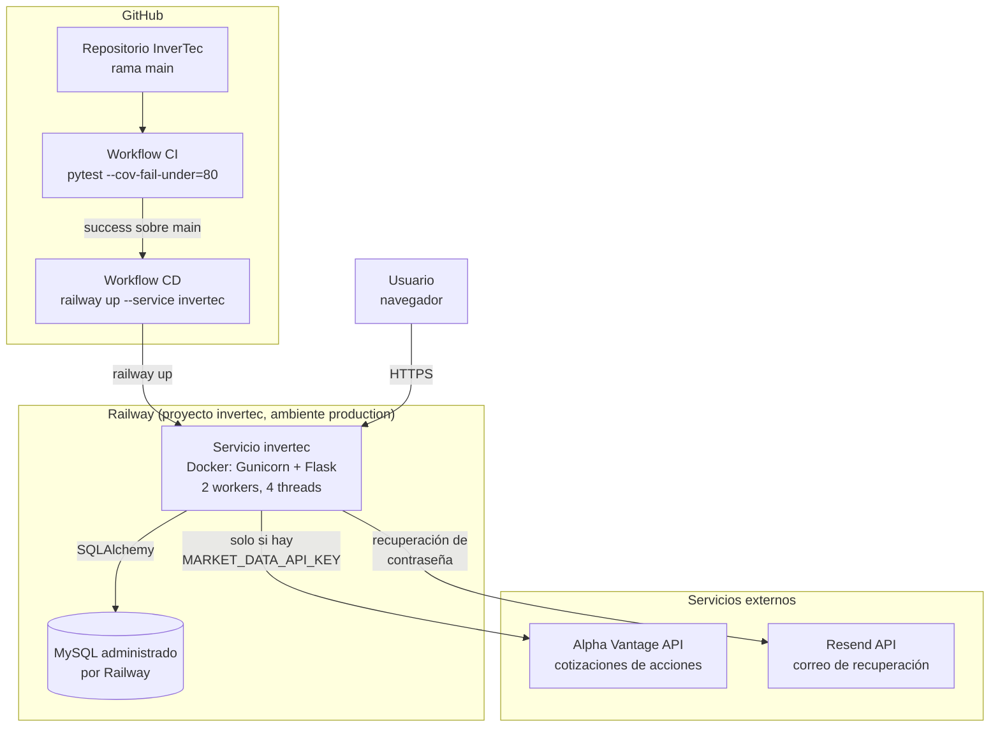

# RUNBOOK_DESPLIEGUE.md — InverTec

Diagrama de arquitectura y procedimientos operativos para el despliegue en producción. Complementa a [DEPLOY.md](DEPLOY.md), que explica cómo se configuró; este documento explica cómo operarlo una vez que ya está corriendo.

## Diagrama de arquitectura



**Flujo de despliegue**: push a `main` → `CI` corre las pruebas → si pasa, `CD` se dispara automáticamente vía `workflow_run` → el Railway CLI construye la imagen con `Docker/Dockerfile` y la despliega al servicio `invertec` → el contenedor corre `flask db upgrade` antes de levantar Gunicorn.

**Flujo de una petición**: el usuario llega al dominio público de Railway (proxy/TLS lo maneja Railway) → Gunicorn reparte la petición entre sus workers → Flask ejecuta la ruta correspondiente → SQLAlchemy consulta MySQL → los precios se leen siempre de la tabla `cotizacion` (una sola fuente para todos los workers); si la ruta es del catálogo (Mercado/Simular), hay `MARKET_DATA_API_KEY` y alguna cotización venció (12h), un solo worker la refresca desde Alpha Vantage en segundo plano, sin retrasar la página; si no hay dato real se sirve el precio de referencia simulado.

## Runbook operativo

### Ver logs en vivo

Railway → proyecto `invertec` → servicio `invertec` → pestaña **Deployments** → abrir el deployment activo. Ahí están mezclados los logs de acceso y error de Gunicorn (ambos van a stdout/stderr por diseño, ver `Docker/entrypoint.sh`).

### Verificar que el servicio está sano

```
curl https://<dominio-generado>.up.railway.app/health
```

Debe responder `{"status": "ok"}` con código 200. **Limitación conocida**: este healthcheck no verifica la conexión a MySQL, solo que el proceso de Flask responde; ver `MONITOREO.md` para el detalle.

### Desplegar un cambio manualmente (si CD no está disponible)

```
railway login
railway link      # proyecto invertec, servicio invertec
railway up
```

Usa el código local, no el de GitHub, así que asegurarse de tener pulleado `main` antes de correrlo.

### Revertir un despliegue

Railway conserva los deployments anteriores: servicio `invertec` → **Deployments** → seleccionar el deployment bueno anterior → **Redeploy**. Es más rápido que un `git revert` cuando la urgencia es solo volver al estado anterior; el `git revert` sigue siendo necesario si además se quiere que `main` refleje el rollback.

### Aplicar una migración nueva

No requiere ningún paso manual en producción: `Docker/entrypoint.sh` corre `flask db upgrade` en cada arranque del contenedor, así que basta con que la migración esté en `database/migrations/versions/` y el despliegue se dispare (automático o manual).

### Escalar

`WEB_CONCURRENCY` (variable de entorno del servicio `invertec`) controla el número de workers de Gunicorn, hoy en `2`. Subirlo es la palanca más simple si el servicio empieza a responder lento bajo carga; no hay autoscaling configurado, es un valor fijo.

### Crear o modificar un usuario administrador

Ver la sección correspondiente en [DEPLOY.md](DEPLOY.md): se hace por consulta SQL directa contra el servicio MySQL de Railway, no hay comando ni endpoint para esto todavía.
